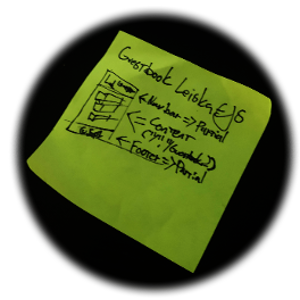

# Project #1 / Fullstack programming / Laurea UAS


### Running on Render.com
#### https://projekti1-guestbook.onrender.com 



Install depencies using `npm install` and to start server use `node app.js`

| Bootstrap 5.3.0-alpha2 - https://getbootstrap.com/ |

| Node v18.13.0 - https://nodejs.org/ |

| Express 4.18.2 - https://expressjs.com/ |

| EJS 3.1.8 - https://ejs.co/ |


app.js rewrites guestData.json every time server starts up on lines 5 -> 48.
```
//--THIS IS FOR EASIER JSON CLEANUP BY RESTARTING SERVER--/
// initial guest data
const initialGuestData = [
  {
    "id": "1",
    "username": "Pam",
    "country": "Anguilla",
    "date": "Thu Feb 22 2007 22:28:32 GMT+0200 (FLE Standard Time)",
    "message": "How are you guys doing?"
  },
  ...
  ...
];

// overwrite guestData.json on server start
fs.writeFileSync("guestData.json", JSON.stringify(initialGuestData));
console.log("guestData.json overwritten")
//--JSON CLEANUP END--// 
```


-Eetu "sip1n" Siponen
